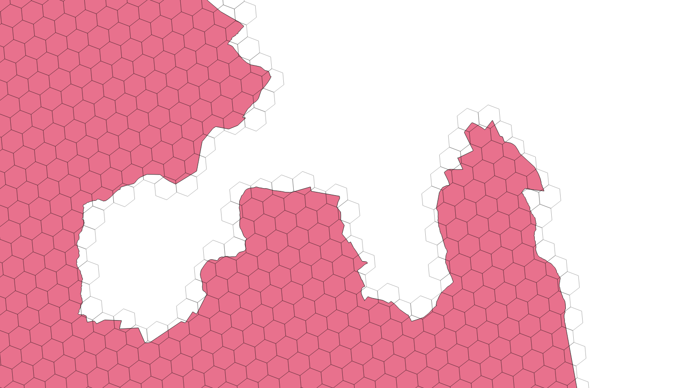

## Files

## H3 hexagons

Base layer : dissolved_Agglo_Verkehrszonen_NPVM_2017_agglo.shp

Process : 

1. fill the dissolved_Agglo_Verkehrszonen_NPVM_2017_agglo.shp layer with h3 hexagon. 

2. Keep the agglomeration attributes

Attributes:

* agglomeration_name: Name of the agglomeration
* agglomeration_country : country of the agglomeration
* h3index : ID of the hexagon

geopackage : 

* path : [data/h3_agglomeration_geopackage.zip](data/h3_agglomeration_geopackage.zip)

* coordinates systems : EPSG:4626 (lat/lng) , EPSG:3857 (web mercator [m]), EPSG:2056 (swiss coordinate [m])

geojson : 

* path : [h3_agglomeration_4326_geojson.zip](h3_agglomeration_4326_geojson.zip)

* coordinates system : EPSG:4626 (lat/lng) according to geojson specifications. 

:rotating_light: For processing using distance or area calculations, make sure to use a local metric coordinate system (or a library that is aware of that).

## Tiles

Process :

1. fill the dissolved_Agglo_Verkehrszonen_NPVM_2017_agglo.shp layer with 500m  squares.

2. Keep the agglomeration attributes

Tiles dimension is based on the official [swisstopo grid ](https://data.geo.admin.ch/ch.swisstopo.images-swissimage-dop10.metadata/shp/2056/ch.swisstopo.images-swissimage-dop10.metadata.zip) (1 km grid) divided by 2 to have 500 m long squares. 

Attributes :

* agglomeration_name: Name of the agglomeration
* agglomeration_country : country of the agglomeration
* index : extended ID according to the official swiss tile ID

Note that the output data has the same coverage as the Swiss official one (no squares are totally outside Switzerland).

## Municipalities

Process :

1. Select the swiss municipalities that have at least 50% of their surface included into a agglomeration (dissolved_Agglo_Verkehrszonen_NPVM_2017_agglo.shp)
2. concatanate the agglomeration's names for each selected municipalities

## Vector tile

Tile url : https://enacit4r-cdn.epfl.ch/lasur-swiss-proximity/2022-11-23/{z}/{x}/{y}.pbf

Style url : https://enacit4r-cdn.epfl.ch/lasur-swiss-proximity/2022-11-23/style_access_5th.json

Small [webapp](https://enacit4r-cdn.epfl.ch/lasur-swiss-proximity/2022-11-23/access_5th_transit.html)

## Styling with MapBox GL or MapLibre

See https://github.com/mapbox/mapbox-gl-native/wiki/Expression-Architecture for a styling explanation.
