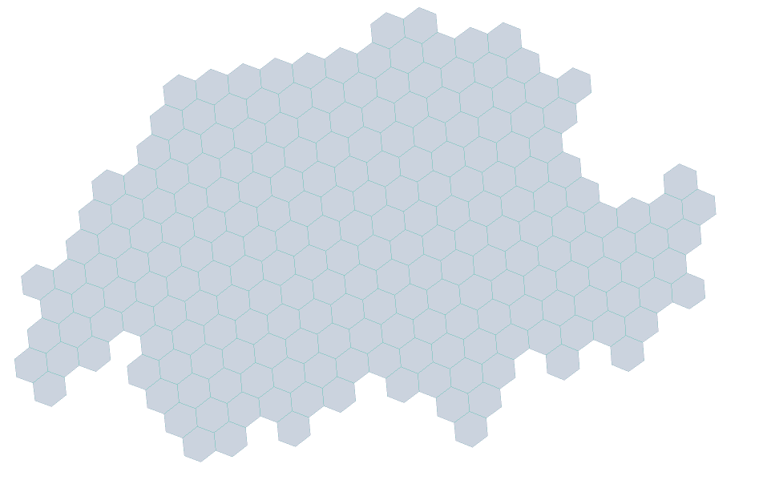
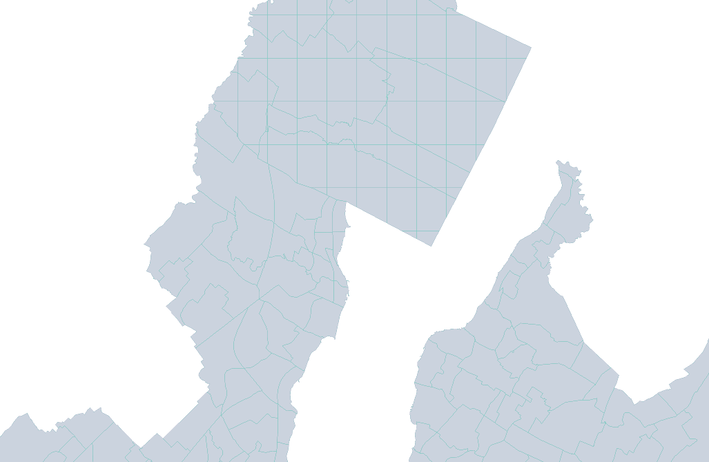

# Mabox vector tiles

# Data

File : access_5th_amenity_transit_0_13.mbtiles

It contains : 

* 2 levels of H3 hexagons (zoom 0 - 8 and 9-10) :
  
  

* and accurate features (zoom 11 -13) :

Both layers (amenity and transit) is included. 

# 

# Data publication

## Via the ENAC CDN

Metadata : https://enacit4r-cdn.epfl.ch/lasur-swiss-proximity/2022-10-25/metadata.json

Example query :`https://enacit4r-cdn.epfl.ch/lasur-swiss-proximity/2022-10-25/{z}/{x}/{y}.pbf`

## In localhost  (tileserver-gl) ?

- Place the file access_5th_amenity_transit_0_13.mbtiles into a folder named "tileserv"

- Run the follwoing command : 
  
   `docker run -it -v ${pwd}/tileserv:/data -p 8080:80 maptiler/tileserver-gl`
* Navigate to http://localhost:8080/ to access a viewer

More if on [GitHub - maptiler/tileserver-gl](https://github.com/maptiler/tileserver-gl)

# Web map

A simple maplibre web map: 

* [amenity](https://enacit4r-cdn.epfl.ch/lasur-swiss-proximity/2022-10-25/access_5th_amenity.html)

* [transit](https://enacit4r-cdn.epfl.ch/lasur-swiss-proximity/2022-10-25/access_5th_transit.html)
